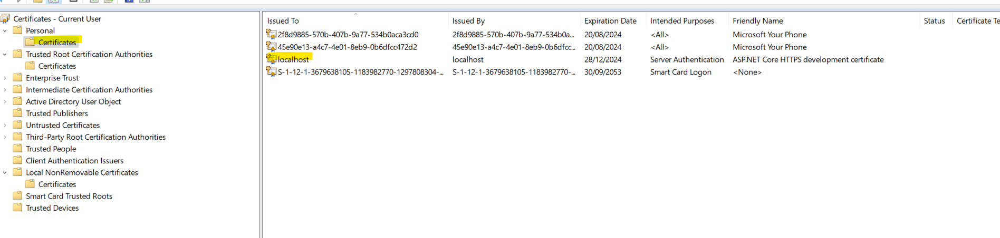

` docker build -t hemantshelar/api:1.0.0 .`

[How to enable https in Docker](https://www.youtube.com/watch?v=lcaDDxJv260)

`dotnet dev-certs https --trust`

After executing above command we should see following two entries in `mmc` certificates console

## Add Docker support

 - Added Dockerfile
 - Build Image
	- `docker build -t weatherapi .`
- Spin up container

`docker run -p 8080:80 -p 8081:443 weatherapi:latest`

Remove certificate

 dotnet dev-certs https --clean

 `dotnet dev-certs https -ep $env:USERPROFILE\.aspnet\https\API.pfx -p p@55w0rD@1234`

The HTTPS developer certificate was generated successfully.

## Trust the certificate

`dotnet dev-certs https --trust`

## Add user secret

`dotnet user-secrets set "Kestrel:Certificates:Development:Password" "p@55w0rD@1234"`

`docker run -p 8080:80 -p 8081:443 -e ASPNETCORE_URLS="https://+;http://+" -e ASPNETCORE_HTTPS_PORT=8081 -e ASPNETCORE_ENVIRONMENT=Development -v C:\Users\User\AppData\Roaming\Microsoft:/root/.microsoft/usersecrets  -v C:\Users\User\AppData\Roaming\Microsoft:/root/.microsoft/usersecrets :/home/app/.microsoft/usersecrets -v C:\Users\User\AppData\Roaming\ASP.NET\Https:/root/.aspnet/https weatherapi`

 docker run -p 8080:80 -p 8081:443 -e ASPNETCORE_URLS="https://+;http://+" -e ASPNETCORE_HTTPS_PORT=8081 -e ASPNETCORE_ENVIRONMENT=Development -v C:\Users\User\AppData\Roaming\Microsoft\UserSecrets:/root/.microsoft/usersecrets  -v C:\Users\User\AppData\Roaming\Microsoft\UserSecrets:/home/app/.microsoft/usersecrets -v C:\Users\User\AppData\Roaming\ASP.NET\Https:/root/.aspnet/https -v C:\Users\User\AppData\Roaming\ASP.NET\Https:/home/app/.aspnet/https  weatherapi

