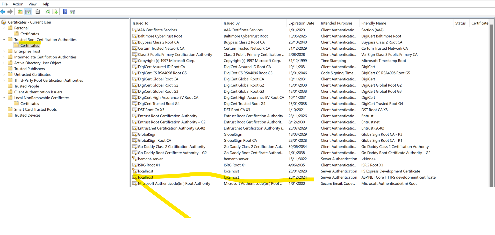

` docker build -t hemantshelar/api:1.0.0 .`

[How to enable https in Docker](https://www.youtube.com/watch?v=lcaDDxJv260)

`dotnet dev-certs https --trust`

After executing above command we should see following two entries in `mmc` certificates console

